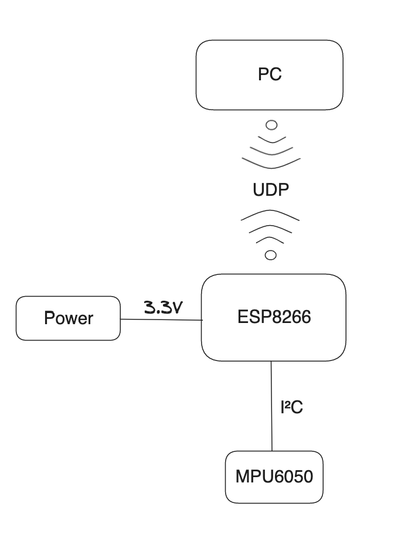

# Wireframe Model Controller

	A wireless Pitch and Roll controller for the model.

## System Architecture

The project was done with an `ESP8266` and the `MPU6050` accelerometer - gyroscope sensor.

The system architecture is shown by the following block diagram:

As indicated in the block diagram the `I2C` protocol was used to establish communication between the sensor and the microcontroller.

Regarding the data transmission channel between the microcontroller and the computer itself, the `UDP` protocol was the preffered choice, as the data integrity in this case was not of as great importance as the transfer speed.

And lastly, the `Kalman Filter` was chosen to filter out the noise of the sensor and make the output smoother.

## Showcase

<video src=".showfiles/video.mp4" controls="controls" width="300">